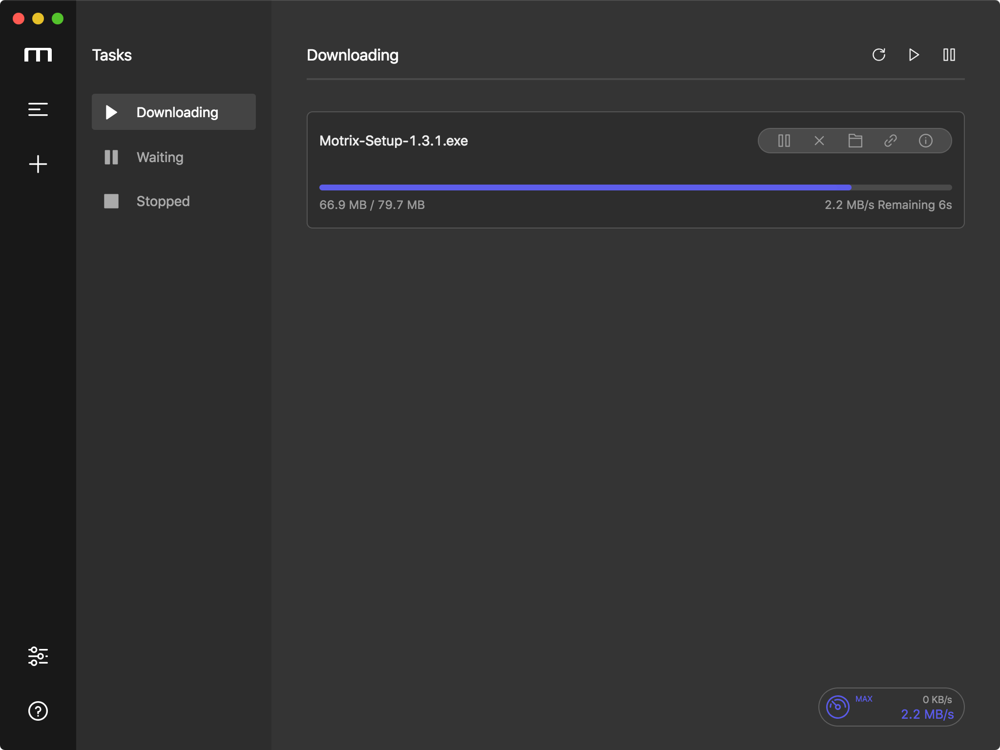
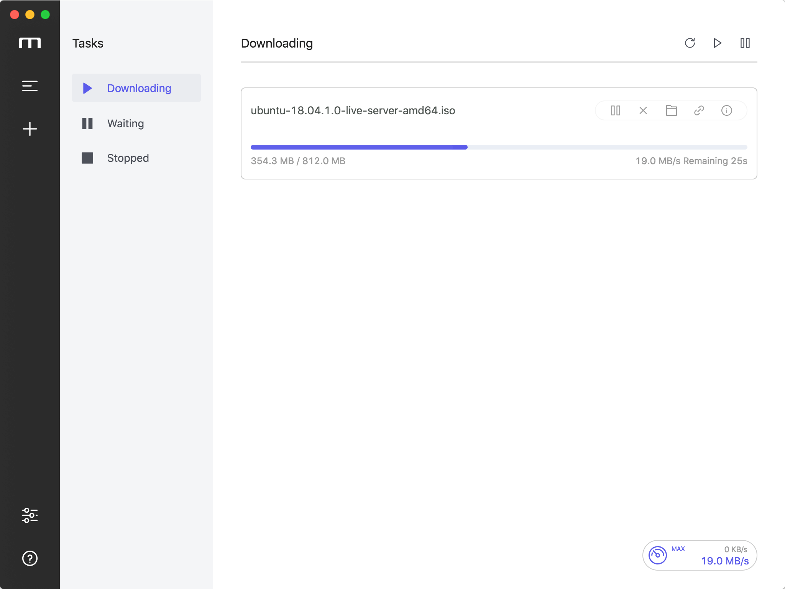

# Super Cat

<a href="https://github.com/LingNaiNya/Super-Cat/releases">
  
</a>

## A full-featured download manager

[](https://github.com/LingNaiNya/Super-Cat/releases) 

English | [简体中文](./README-CN.md)

Super Cat is a full-featured download manager that supports downloading HTTP, FTP, BitTorrent, Magnet, etc.

It is a fork of [Motrix](https://github.com/agalwood/Motrix), with an updated UI, an in-app update channel powered by GitHub Releases, and ongoing feature work.

## 💽 Installation

Download the installer from [GitHub Releases](https://github.com/LingNaiNya/Super-Cat/releases) and run it.

### Windows

Use the installation package `Super-Cat-Setup-x.y.z.exe` for the full experience, such as associating torrent files and capturing magnet links.

> The package is not code-signed yet. Windows SmartScreen may warn "Unknown publisher" on first run — choose "Run anyway".

### macOS / Linux

No prebuilt packages are published at the moment; build from source (see **Development** below) with `npm run build`.

## ✨ Features

- 🕹 Simple and clear user interface
- 🦄 Supports BitTorrent & Magnet
- ☑️ BitTorrent selective download
- 📡 Automatic tracker list updates
- 🔌 UPnP & NAT-PMP port mapping
- 🎛 Up to 10 concurrent download tasks
- 🚀 Supports 64 threads in a single task
- 🚥 Supports speed limit
- 🕶 Mock User-Agent
- 🔔 Download completed notification
- 💻 Ready for Touch Bar (Mac only)
- 🤖 Resident system tray for quick operation
- 📟 Tray speed meter displays real-time speed (Mac only)
- 🌑 Dark mode
- 🗑 Delete related files when removing tasks (optional)
- 📦 In-app update checks against GitHub Releases
- 🌍 I18n, [View supported languages](#-internationalization).
- 🛠 More features in development

## 🖥 User Interface

| Task list (dark) | Task list (light) |
|---|---|
|  |  |

## ⌨️ Development

### Clone code

```bash
git clone https://github.com/LingNaiNya/Super-Cat.git
cd Super-Cat
```

### Install dependencies

```bash
npm install
```

### Dev mode

```bash
npm run dev
```

### Build release

```bash
npm run build
```

The packaged application will be found in the project's `release` directory. See [RELEASE.md](./RELEASE.md) for the full release workflow.

## 🛠 Technology Stack

- [Electron](https://electronjs.org/)
- [Vue](https://vuejs.org/) + [VueX](https://vuex.vuejs.org/) + [Element](https://element.eleme.io)
- [Aria2](https://aria2.github.io/)

## 🤝 Contribute [](http://makeapullrequest.com)

If you are interested in participating in joint development, PR and Forks are welcome!

## 🌍 Internationalization

Translations into versions for other languages are welcome 🧐! Please read the [translation guide](./CONTRIBUTING.md#-translation-guide) before starting translations.

| Key   | Name                | Status       |
|-------|:--------------------|:-------------|
| ar    | Arabic              | ✔️ [@hadialqattan](https://github.com/hadialqattan), [@AhmedElTabarani](https://github.com/AhmedElTabarani) |
| bg    | Българският език    | ✔️ [@null-none](https://github.com/null-none) |
| ca    | Català              | ✔️ [@marcizhu](https://github.com/marcizhu) |
| de    | Deutsch             | ✔️ [@Schloemicher](https://github.com/Schloemicher) |
| el    | Ελληνικά            | ✔️ [@Likecinema](https://github.com/Likecinema) |
| en-US | English             | ✔️           |
| es    | Español             | ✔️ [@Chofito](https://github.com/Chofito)|
| fa    | فارسی               | ✔️ [@Nima-Ra](https://github.com/Nima-Ra) |
| fr    | Français            | ✔️ [@gpatarin](https://github.com/gpatarin) |
| hu    | Hungarian           | ✔️ [@zalnaRs](https://github.com/zalnaRs) |
| id    | Indonesia           | ✔️ [@aarestu](https://github.com/aarestu) |
| it    | Italiano            | ✔️ [@blackcat-917](https://github.com/blackcat-917) |
| ja    | 日本語               | ✔️ [@hbkrkzk](https://github.com/hbkrkzk) |
| ko    | 한국어                | ✔️ [@KOZ39](https://github.com/KOZ39) |
| nb    | Norsk Bokmål        | ✔️ [@rubjo](https://github.com/rubjo) |
| nl    | Nederlands          | ✔️ [@nickbouwhuis](https://github.com/nickbouwhuis) |
| pl    | Polski              | ✔️ [@KanarekLife](https://github.com/KanarekLife) |
| pt-BR | Portuguese (Brazil) | ✔️ [@andrenoberto](https://github.com/andrenoberto) |
| ro    | Română              | ✔️ [@alyn3d](https://github.com/alyn3d) |
| ru    | Русский             | ✔️ [@bladeaweb](https://github.com/bladeaweb) |
| th    | แบบไทย              | ✔️ [@nxanywhere](https://github.com/nxanywhere) |
| tr    | Türkçe              | ✔️ [@abdullah](https://github.com/abdullah) |
| uk    | Українська          | ✔️ [@bladeaweb](https://github.com/bladeaweb) |
| vi    | Tiếng Việt          | ✔️ [@duythanhvn](https://github.com/duythanhvn) |
| zh-CN | 简体中文             | ✔️           |
| zh-TW | 繁體中文             | ✔️ [@Yukaii](https://github.com/Yukaii) [@5idereal](https://github.com/5idereal) |

## 🙏 Acknowledgements

Super Cat is based on [Motrix](https://github.com/agalwood/Motrix) by [Dr_rOot](https://github.com/agalwood). Thanks to the original author and all upstream contributors.

## 📜 License

[MIT](https://opensource.org/licenses/MIT) Copyright (c) 2018-present Dr_rOot
